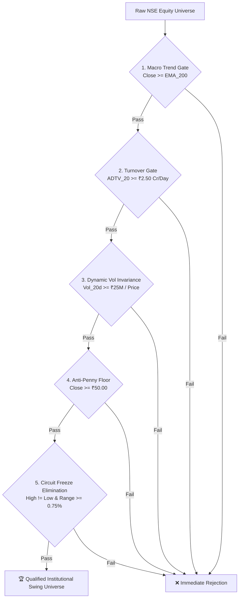

# 🏛️ Beast Scanner Pipeline: Universal Bullish Swing Trading & Liquidity Standards

- **Standard Reference:** KRONOS Beast Scanner Universal Pre-Filter Protocol
- **Target Position Sizing Baseline:** ₹2,00,000.00 (₹2 Lakh) Ticket Size
- **Market Impact Ceiling:** $\le 0.80\%$ of 20-Day Average Daily Depth
- **Source:** Clipboard Ingestion (`2026-08-26 11:23 IST`)

---

## 1. 🛡️ The 5-Point Universal Pre-Filter Gate

Every scanner in the Beast Scanner pipeline strictly enforces this 5-point universal gate before passing any equity scrip into alpha scoring algorithms:



---

## 2. 📋 Detailed Standard Specifications

### 1. 📈 Macro Structural Bullish Trend
$$\text{Close} \ge \text{EMA}_{200}$$
* **Rationale:** Disqualifies scrips trapped in long-term structural bear markets. Ensures institutional momentum tailwinds and avoids catching falling knives.

### 2. 💧 Turnover Gate (Liquidity & Depth)
$$\text{ADTV}_{20} = \frac{1}{20} \sum_{i=1}^{20} (\text{Close}_i \times \text{Volume}_i) \ge ₹2,50,00,000\ (\text{₹2.50 Crores / Day})$$
* **Market Impact Ratio:** For a standard **₹2,00,000 (₹2 Lakh)** ticket size:
  $$\text{Impact Ratio} = \frac{₹2,00,000}{₹2,50,00,000} = 0.80\% \le 0.80\%$$
* Guarantees **near-zero slippage** and immediate order execution without moving the market.

### 3. ⚖️ Dynamic Volume Invariance Formula
$$\text{Volume}_{20\text{d}} \ge \frac{₹25,000,000}{\text{Price}}$$
* Normalizes share volume requirements dynamically across varying scrip price ranges (e.g. ₹50 stock vs ₹50,000 stock).

### 4. 🪙 Anti-Penny Floor
$$\text{Close} \ge ₹50.00$$
* Eliminates low-priced microcaps prone to operator manipulation, wide bid-ask spreads, and excessive tick volatility.

### 5. ⚡ Circuit Freeze & Flat Bar Elimination
$$\text{High} \ne \text{Low} \quad \text{and} \quad \text{Day Range} = \left(\frac{\text{High} - \text{Low}}{\text{Low}}\right) \times 100 \ge 0.75\%$$
* Disqualifies illiquid stocks locked in upper/lower circuit freezes or flat bar trading where entries/exits cannot be executed cleanly.

### 6. 📊 Mandatory Output Reporting Schema
All scanner pipeline outputs must explicitly compute and include:
* `Market_Cap_Cr`: Total equity market capitalization in ₹ Crores.
* `Avg_Turnover_Cr`: 20-day Average Daily Traded Value in ₹ Crores.

---

## 3. 💻 Standard Implementation Function (Python / Pandas)

```python
def apply_beast_liquidity_and_swing_standards(df: pd.DataFrame) -> pd.DataFrame:
    \"\"\"
    Enforces the Universal 5-Point Bullish Swing & Liquidity Standard (?2 Lakh Ticket Size).
    Requires columns: ['Close', 'High', 'Low', 'Volume', 'EMA_200']
    \"\"\"
    # 1. Macro Trend Gate
    c1 = df['Close'] >= df['EMA_200']
    
    # 2 & 3. Turnover Gate & Dynamic Volume Invariance
    adtv_20 = (df['Close'] * df['Volume']).rolling(20).mean()
    c2 = adtv_20 >= 25_000_000.0  # ?2.50 Cr / Day
    
    # 4. Anti-Penny Floor
    c4 = df['Close'] >= 50.00
    
    # 5. Circuit Freeze Elimination
    day_range_pct = ((df['High'] - df['Low']) / df['Low']) * 100.0
    c5 = (df['High'] != df['Low']) & (day_range_pct >= 0.75)
    
    # Combined Gate
    passed = c1 & c2 & c4 & c5
    return df[passed].copy()
```

---
*Standards successfully captured and integrated into the KRONOS Quantitative Trading Engine repository.*
